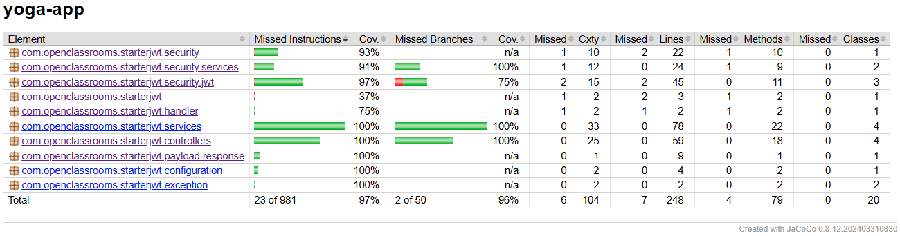
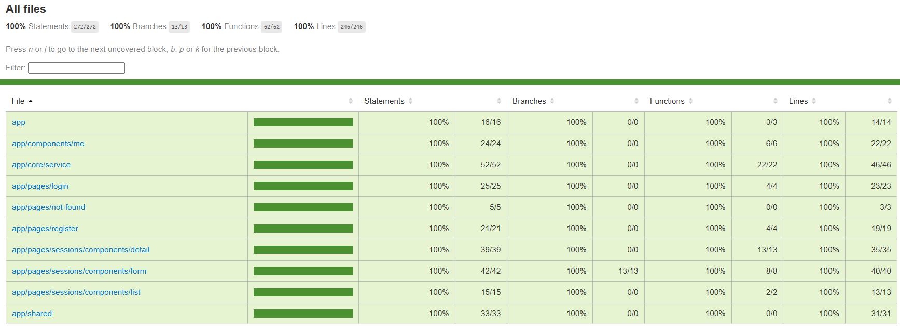
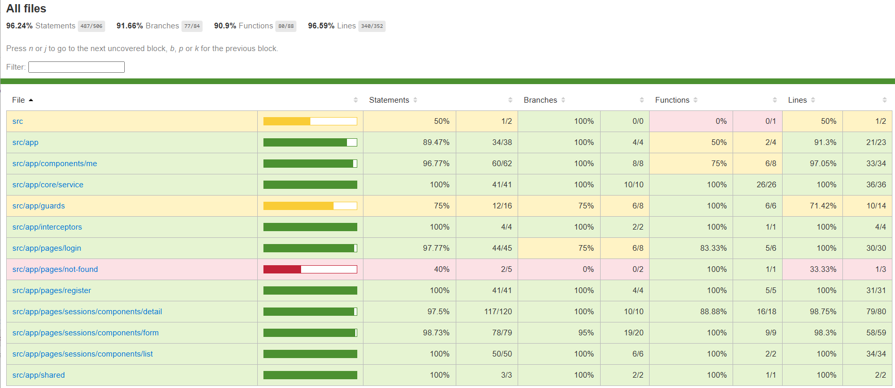

# YogaApp: Full-Stack Testing & Quality Assurance

This repository showcases a comprehensive testing strategy for a full-stack Yoga session management application. Based on the OpenClassrooms "Testez et améliorez une application full-stack" project, the primary objective of this repository is to demonstrate rigorous quality assurance using modern testing frameworks for both Spring Boot and Angular.

The application allows users to view available yoga sessions, inspect details, and manage subscriptions. Admin users have additional privileges to create, update, and delete sessions.

---

## 🛠 Technology Stack (Testing Focus)

### Backend (Java/Spring Boot)

- **JUnit 5 & Spring Test:** For unit and integration testing of controllers and services.
- **Mockito:** For mocking dependencies and isolating components.
- **JaCoCo:** For generating detailed code coverage reports.

### Frontend (Angular)

- **Jest:** A fast, modern alternative to Jasmine for unit and integration tests.
- **Cypress:** For robust End-to-End (E2E) testing.
- **Istanbul/NYC:** For tracking frontend code coverage.

---

## 🚀 Getting Started

### Backend Setup

1. Navigate to the `/back` directory.
2. Follow the specific environment setup instructions located in the `README.md` within the backend folder (database configuration, etc.).
3. Run the application:

```bash
mvn spring-boot:run
```

### Frontend Setup

1. Navigate to the `/front` directory.
2. Install dependencies:

```bash
npm install
```

3. Launch the development server:

```bash
npm run start
```

---

## 🧪 Testing Strategy & Execution

### Backend Tests

To execute the suite of unit and integration tests and generate the JaCoCo coverage report:

```bash
mvn clean verify
```

### Frontend Tests

**Unit & Integration (Jest):**

```bash
npx jest
```

**End-to-End (Cypress):**

Headless mode (CLI):

```bash
npx cypress run --spec "cypress/e2e/all.e2e.spec.cy.ts"
```

Cypress GUI:

```bash
npx cypress open
```

---

## 📊 Coverage Reports

The project maintains exceptionally high testing standards, ensuring that almost every logic path is validated.

### Backend Coverage (JaCoCo)

The backend achieves **97% instruction coverage**, with critical packages like controllers and services hitting **100%**.



### Frontend Coverage (Jest & Cypress)

The frontend testing suite achieves near-total coverage, ensuring high confidence in component logic and user interactions.

**Jest Report**



**Cypress Report**



---

## 📝 Key Features Tested

- **Authentication:** Secure login/register flows for both Users and Admins.
- **Session Management:** CRUD operations for sessions.
- **User Interaction:** Ability to participate in or leave a session with real-time UI updates.
- **Error Handling** 